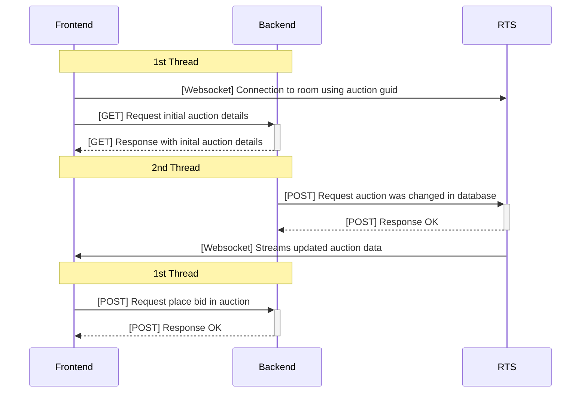

```mermaid
sequenceDiagram
    Note over Frontend, Backend: 1st Thread
    Frontend ->> RTS: [Websocket] Connection to room using auction guid
    Frontend ->>+ Backend: [GET] Request initial auction details
    Backend -->>- Frontend: [GET] Response with inital auction details
    Note over Frontend, Backend: 2nd Thread
    Backend ->>+ RTS: [POST] Request auction was changed in database
    RTS -->>- Backend: [POST] Response OK
    RTS ->> Frontend: [Websocket] Streams updated auction data
    Note over Frontend, Backend: 1st Thread
    Frontend ->>+ Backend: [POST] Request place bid in auction
    Backend -->>- Frontend: [POST] Response OK
```